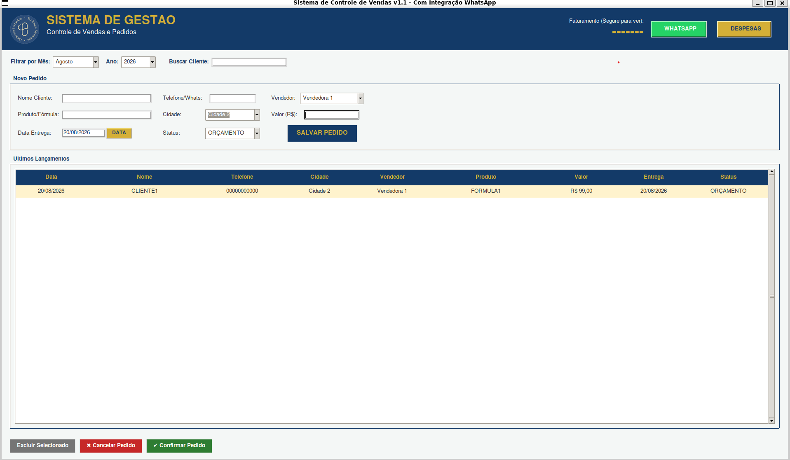

# Pharmacy Order Management

Sistema de gestão de pedidos, vendas e entregas para farmácia de manipulação,
em uso real. Roda em várias máquinas da rede local compartilhando a mesma base,
sem servidor dedicado.

<p align="center">
  
</p>


---

## O problema

A farmácia precisava que várias pessoas, em computadores diferentes, registrassem
e consultassem pedidos ao mesmo tempo — e enxergassem as alterações umas das
outras. As soluções óbvias não serviam:

- **Planilha compartilhada:** trava quando duas pessoas editam, e não impõe
  nenhuma regra sobre os dados.
- **Sistema com servidor:** exige uma máquina dedicada, manutenção e custo
  recorrente que não se justificavam para a escala do negócio.
- **Serviço em nuvem:** dependeria de internet estável, que nem sempre havia.

## A solução

Um modelo cliente-servidor simplificado: o banco SQLite fica numa pasta
compartilhada da rede (`\\SERVIDOR\Sistema\vendas.db`) e cada máquina aponta para
ele através de um arquivo de configuração local (`caminho_db.txt`).

A sincronização é resolvida por *polling*: a tabela recarrega a cada 5 segundos.
Não é a técnica mais elegante, mas para uma rede local com poucos usuários
simultâneos ela é simples, previsível e não tem nada para dar errado — o que
importa mais do que sofisticação num sistema que precisa funcionar todo dia.

A distribuição é feita com PyInstaller: cada máquina recebe um `.exe`, sem
precisar de Python instalado.

## Funcionalidades

**Controle de vendas (v1.0)**
- Cadastro de pedidos com autocomplete de clientes e produtos
- Sincronização entre máquinas da rede
- Atualização automática da listagem a cada 5 segundos
- Status com indicação visual por cor

**Módulo financeiro (v1.1)**
- Registro e acompanhamento de despesas
- Acesso protegido por senha
- Projeção automática de despesas recorrentes
- Filtro por mês e ano

**Integração com WhatsApp (v1.2)**
- Envio de mensagens pelo WhatsApp Web
- Modelos de mensagem com variáveis dinâmicas
- Gestão automática de contatos

## Stack

| Camada | Tecnologia |
|---|---|
| Linguagem | Python 3 |
| Interface | Tkinter |
| Banco de dados | SQLite3 |
| Distribuição | PyInstaller (`.exe`) |
| Bibliotecas | tkcalendar, Pillow |

## Como rodar

```bash
git clone https://github.com/btretto03/pharmacy-order-management.git
cd pharmacy-order-management

python -m venv .venv
source .venv/bin/activate      # Windows: .venv\Scripts\activate
pip install -r requirements.txt

python planilha.py
```

Na primeira execução, informe o caminho do banco. Ele fica salvo em
`caminho_db.txt` e não é versionado.

### Gerar o executável

```bash
pyinstaller --onefile --windowed --icon=logo.ico planilha.py
```

## Banco de dados

<!-- Descreva as tabelas aqui: colunas principais de `pedidos`, `despesas` e
     `mensagens`. Um avaliador olha isso para julgar sua modelagem de dados,
     e é rápido de escrever. -->

| Tabela | Função |
|---|---|
| `pedidos` | Pedidos, clientes, valores, status e datas de entrega |
| `despesas` | Lançamentos financeiros, com suporte a recorrência |
| `mensagens` | Modelos de mensagem para o WhatsApp |

O `criar_tabela()` traz migração de schema embutida: ao abrir uma base criada por
uma versão anterior, as colunas novas são adicionadas sem perder dados. Isso foi
necessário porque o sistema já estava em uso quando o módulo financeiro entrou —
não dava para pedir que recomeçassem do zero.

## Decisões técnicas

**Por que SQLite em rede em vez de PostgreSQL ou MySQL?** Ambos exigiriam um
servidor rodando e alguém para mantê-lo. O SQLite é um arquivo: faz backup com
copiar e colar, e não quebra se a máquina "servidor" for desligada no fim do
expediente — o que, num comércio, acontece todo dia.

**Por que polling em vez de notificação de mudanças?** Com poucos usuários na
mesma rede, 5 segundos de latência são imperceptíveis, e a alternativa exigiria
um processo escutando eventos — mais uma peça para falhar.

**Por que Tkinter?** Vem na biblioteca padrão. Sem dependência gráfica externa, o
executável do PyInstaller fica menor e a instalação nas máquinas é copiar um
arquivo.

## Limitações conhecidas

Ser honesto sobre o que falta é parte do projeto:

- **`planilha.py` concentra tudo** — 1.390 linhas numa única classe. Separar em
  camadas (dados, regras de negócio, interface) é a próxima refatoração.
- **Sem testes automatizados.** As regras de negócio do financeiro são as
  candidatas naturais para começar.
- **O SQLite em rede tem limite.** Funciona bem nesta escala; com muitas escritas
  simultâneas, o modelo de lock por arquivo passaria a ser um gargalo.

## Licença

Código proprietário, com todos os direitos reservados. A visualização é
permitida para fins de avaliação técnica, educacional ou de recrutamento;
cópia, distribuição, modificação e uso comercial dependem de autorização.
Veja [LICENSE](LICENSE).

---

<sub>Desenvolvido para uso real em farmácia de manipulação.</sub>
